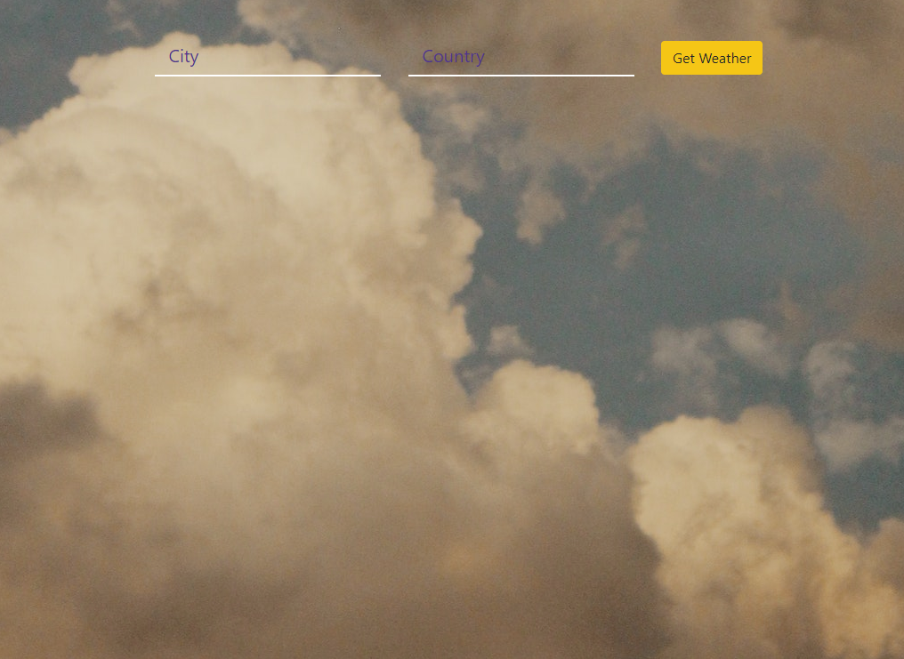
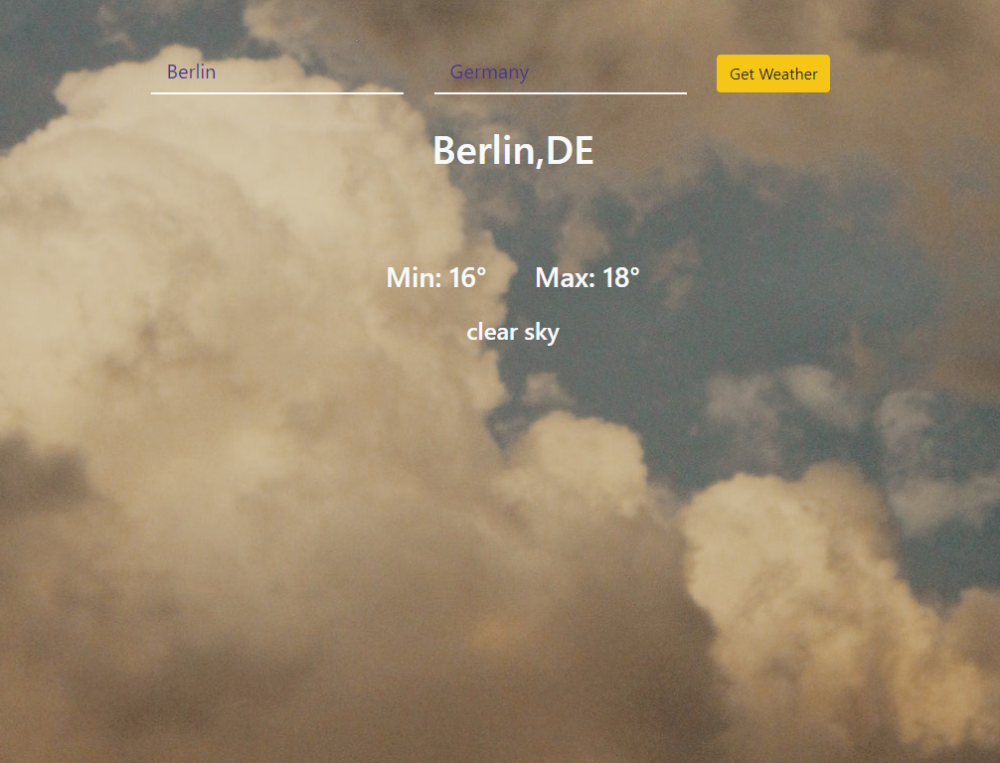

# weather-app-react

Brings the weather according to the city and country you entered.

<ul>
  <li><strong>Api:</strong> https://openweathermap.org/</li>
  <li><strong>Icons:</strong> https://github.com/erikflowers/weather-icons</li>
  
</ul>

